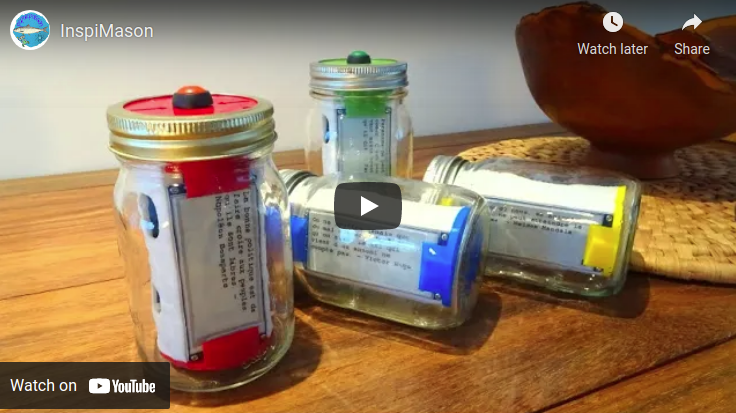

# InspiMason
***

***

***
This repo contains files about a Christmas project called InspiMason. InspiMason is a small device fitted in a glass jar to save and share inspiring quotes! It used an ESP8266 brain and WiFi, a 2.9 inches waveshare epaper display, a few WS2812B RGB leds, a switch, a single cell Lipo battery and charging circuitry. Over one thousand twitter like quotations (about 160 caracters max) are stored in a text file and displyed one at a time when user presses a button. Device spends most of its time in deep sleep mode so battery can last long while the text remains on the epaper. File with quotations can be download from a [compagnon web site](http://www.chezpapietmamie.com/inspimason/) or user edited then changed by accessing the device via a web page. Can also type in a text to disply immediately on the device. All project details are available on the [project page](http://www.chezpapietmamie.com/pcube/uncategorized/inspimason/) . Do not hesitate to reach me shall you have any question or comment.
***

